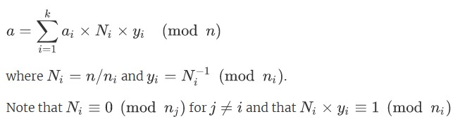
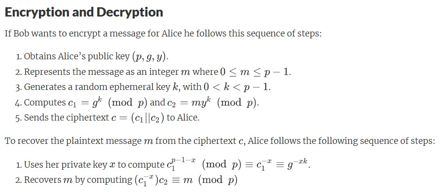
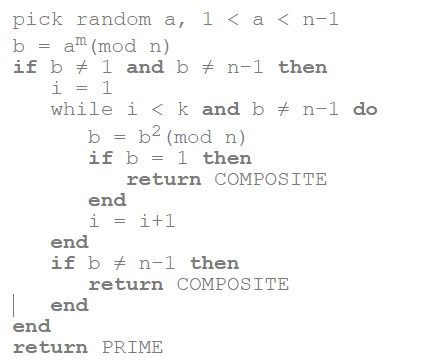
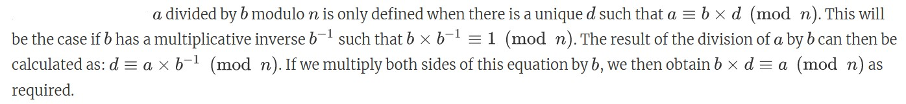
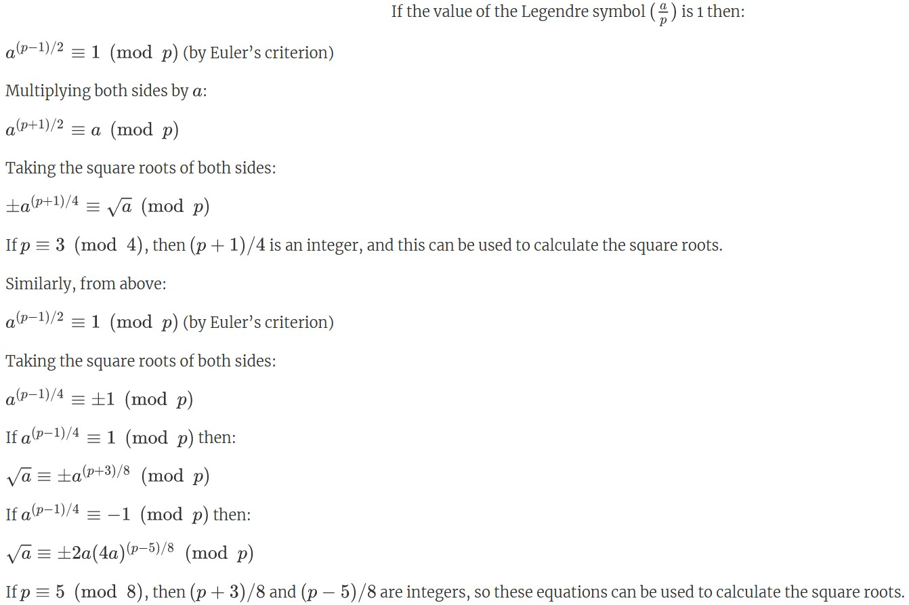
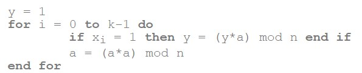
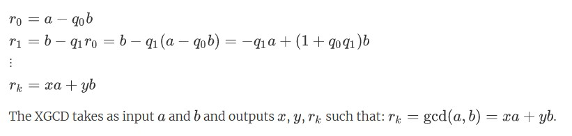
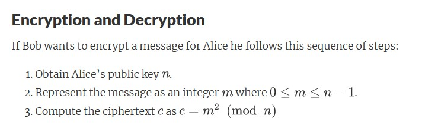
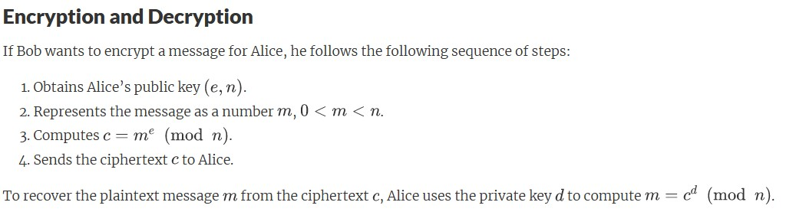
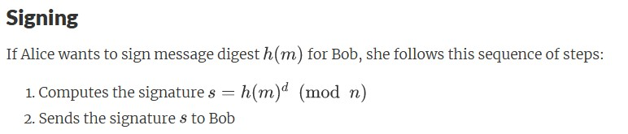

# Cryptography

### Chinese Remainder Theorem

The Chinese Remainder Theorem (CRT) allows us to replace a modular computation using a large composite modulus with smaller more efficient computations using the factors of the modulus instead. 

---

### ElGamal Encryption

The ElGamal public key encryption technique was first published in 1985 by Taher ElGamal: "A Public Key Cryptosystem and a Signature Scheme Based on Discrete Logarithms". 
The public key is represented by the values (p,g,y) where prime p > 512 bits, and y = g^x (mod p) with 0 < x < p-1 and g of the multiplicative group Z*p.

Need to create to cipherkeys with the message m and a key, 0 < k < p-1.

- c1 = g^k (mod p)
- c2 = my^k (mod p)

To decrypt a message, you solve c1^ (p-1-x) mod p which is c1^-x.
This is used to solve c1^-x * c2 mod p

---

### GCD

The Euclidean Algorithm is a technique for quickly finding the Greatest Common Divisor of two integers.

For example, gcd(24, 36) = 12

---

### Miller-Rabin primality test 

This was created by Gary Miller and Michael O. Rabin and also makes use of Fermat’s Little Theorem. To test an odd number **n** for primality, we let **2^k** be the largest power of **2** dividing **n-1**. Thus we have  **n-1 = 2^k(m)** for some odd number **m**. 

---

### Modular Division

Dividing an A/B mod N is the same as calculating A * (B ^-1) mod N. 
So using the modular inverse function, we get: 

- A * (modInv(B, N)) .mod(N)

### Modular Square Roots

To find the square roots of a number A modulo N, N must be prime or have prime factors. For example, 59 is prime. 77 is not prime but has prime factors 7 and 11.

---

### Modular Exponentiation 

This is widely used in public key cryptography. The modular exponentiation **a^x(mod n)** is just repeated multiplication (**a** multiplied by itself **x** times). 

The right to left variant of this algorithm for calculating a^x (mod n) where the exponent x is k bits long is as follows: 

For example, 123 ^ 5 mod 511 = 359

---

### Modular Inverse

Using the Euclidean algorithm, we can determine if a has an inverse modulo n which will be the case when gcd(a, n) = 1.

To do this, we can use an extended version of the Euclidean algorithm. 

For example, 67^-1 mod 119 = 93

---

### Rabin Encryption

This function will find the ciphertext c where m^2 (mod n)
To find the possible square root answers for the rabin decryption, use ModularSquareRoots.java

--- 

## RSA Ecryption

The first published method for implementing public key cryptography was by Ron Rivest, Adi Shamir and Leonard Adleman, all then at MIT: “A Method for Obtaining Digital Signatures and Public-Key Cryptosystems”. The algorithm came to be known as RSA from their initials. It turns out that this method had also been previously discovered at GCHQ by Clifford Cocks.

RSA is the most widely known and used asymmetric cipher. Both the private and public keys can be used for encryption, with the other key then used for decryption. 

The class can encrypt and decrypt.

The class can also sign messages if the hash message is given. Signing a message uses the decryption method.

